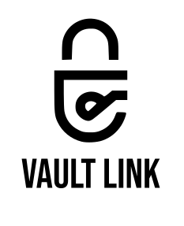
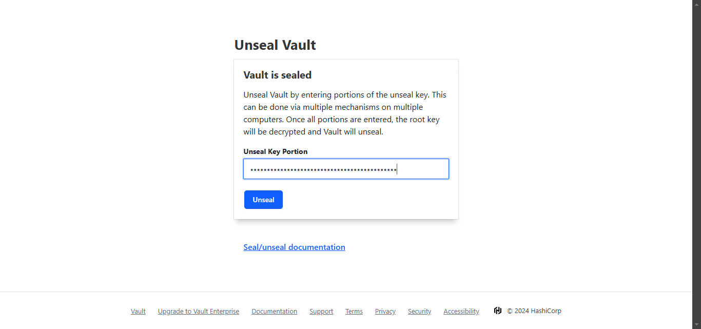
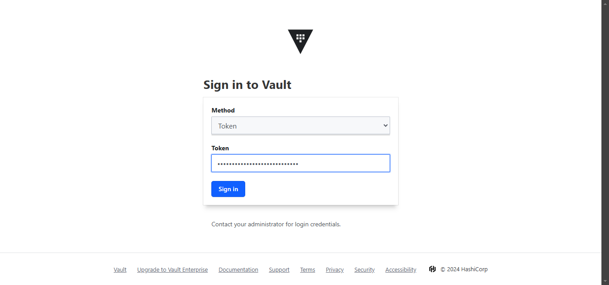
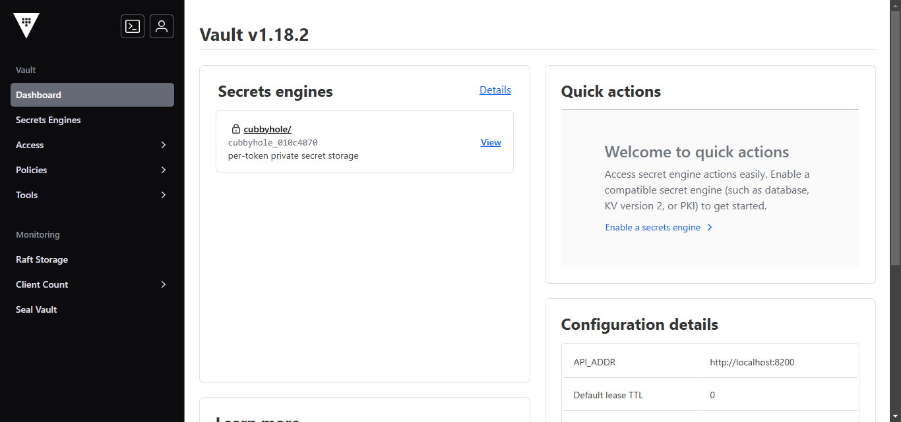
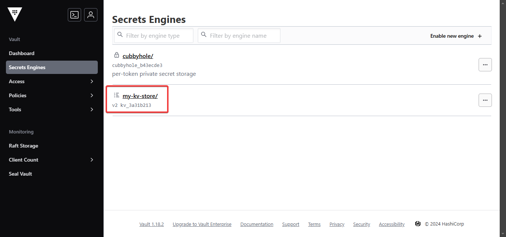
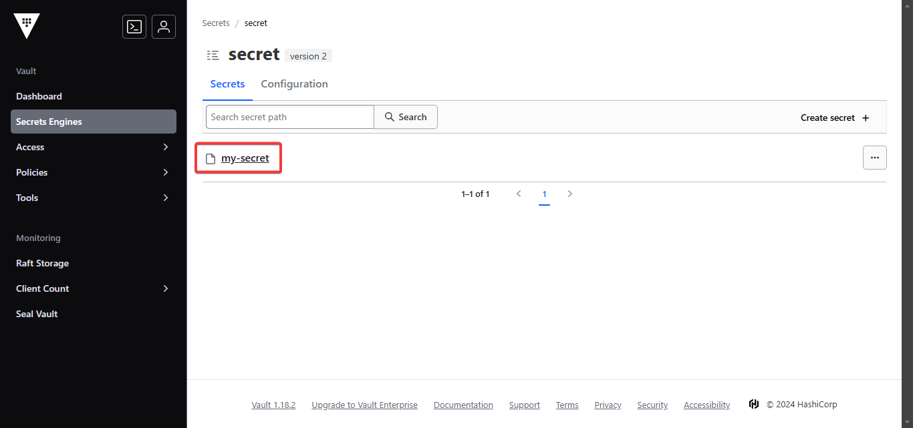
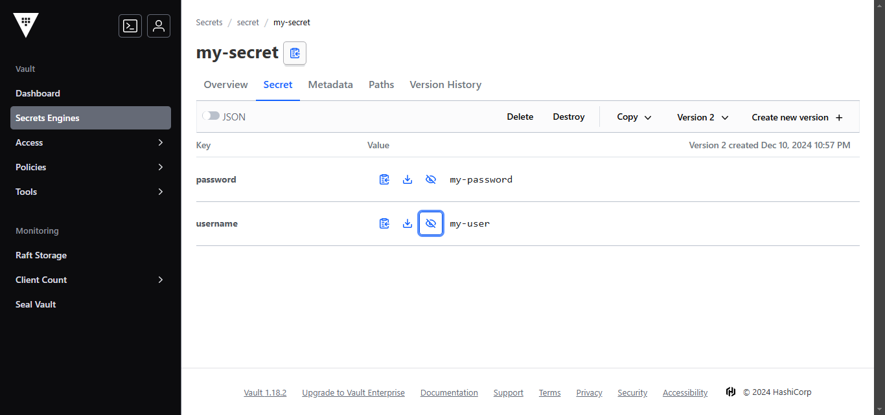

 [](https://openexchange.intersystems.com/package/intersystems-iris-dev-template)
 [](https://community.objectscriptquality.com/dashboard?id=musketeers-br%2Fvault-link)
 [](https://community.objectscriptquality.com/dashboard?id=musketeers-br%2Fvault-link)

[](LICENSE)

# vault-link



Vault-Link is a security solution designed to safeguard sensitive information on InterSystems IRIS environments. 

## Description

Vault-Link is a security solution designed to safeguard sensitive information on InterSystems IRIS environments. 

It is a wrapper to access secrets stored into key vaults. Here we are using [Hashicorp Vault Community](https://www.vaultproject.io/) as a key vault.

This project was inspired in [this idea from InterSystems Ideas portal](https://ideas.intersystems.com/ideas/DP-I-179).

## Features

* Wrapper to access secrets stored into key vaults
* It is a wrapper to access secrets stored into key vaults

## Installation on your IRIS instance

Execute the following command to install the package into your IRIS instance:

```bash
zpm "install vault-link"
```

If you want just to test the package, follow the [#Running the demo environment](#Running-the-demo-environment) section.

## Running the demo environment

Make sure you have [git](https://git-scm.com/book/en/v2/Getting-Started-Installing-Git) and [Docker desktop](https://www.docker.com/products/docker-desktop) installed.

Clone/git pull the repo into any local directory

```bash
git clone https://github.com/musketeers-br/vault-link.git
cd vault-link
```

First you have to setup a Hashicorp Vault instance. After that you can setup the IRIS instance and run the demo.

### Hashicorp Vault setup

> **Note: The steps provided below are only for a local demo environment. It's not intended to be used in a production environment**

Open the terminal in this directory and call the command to build and run InterSystems IRIS in container:
*Note: Users running containers on a Linux CLI, should use "docker compose" instead of "docker-compose"*
*See [Install the Compose plugin](https://docs.docker.com/compose/install/linux/)*

```bash
cd hashicorp/vault
docker-compose up -d
```

Wait for the containers be ready.

Now we need to start the Hashicorp Vault container. A single configuration for it is provided at folder `./hashicorp/vault`. 

Access the Hashicorp Vault container and initialize the vault:

```bash
docker exec -it vault-new-1 /bin/sh
vault operator init
```

If all went well, you should see something like this:

```
Unseal Key 1: <unseal-key-1>
Unseal Key 2: <unseal-key-2>
Unseal Key 3: <unseal-key-3>
Unseal Key 4: <unseal-key-4>
Unseal Key 5: <unseal-key-5>

Initial Root Token: <token>

Vault initialized with 5 key shares and a key threshold of 3. Please securely
distribute the key shares printed above. When the Vault is re-sealed,
restarted, or stopped, you must supply at least 3 of these keys to unseal it
before it can start servicing requests.

Vault does not store the generated root key. Without at least 3 keys to
reconstruct the root key, Vault will remain permanently sealed!

It is possible to generate new unseal keys, provided you have a quorum of
existing unseal keys shares. See "vault operator rekey" for more information.
```

This output indicates that the vault has been initialized with 5 unseal key and a key threshold of 3, which means that you have to use 3 of these keys to unseal the Vault.

```
Unseal Key 1: <unseal-key-1>
Unseal Key 2: <unseal-key-2>
Unseal Key 3: <unseal-key-3>
Unseal Key 4: <unseal-key-4>
Unseal Key 5: <unseal-key-5>
```

A token is also generated, which you will use to access the vault.

```
Initial Root Token: <token>
```

Now access the vault UI at [http://localhost:18200](http://localhost:18200).

You will be prompted to unseal the vault by providing the 3 unseal keys. Enter 3 of any of the 5 given in the output of the previous command.



After that, you will be asked to provide a token. Enter the token generated in the output of the previous command.



Congrats! You have successfully setup the Hashicorp Vault container.



Now you can exit the container.

```
exit
```

### InterSystems IRIS setup

Now let's setup the IRIS container. 

First lets setup some environment variables used by the IRIS container. Replace &lt;token&gt; with your Hashicorp Vault token.

```bash
export VAULT_LINK_HASHICORP_VAULT_TOKEN="<token>"
export VAULT_LINK_HASHICORP_VAULT_BASE_URL="http://host.docker.internal:18200"
```

Run the following command to build and run InterSystems IRIS in container. Make sure you are in the root of the repository.

```bash
cd ../../
docker-compose up -d
```

## Usage

Access the InterSystems IRIS container:

```bash
docker exec -it vault-link-iris-1 /bin/bash
iris session iris -U IRISAPP
```

First let's create a generic key-value engine (KV):

```objectscript
Do ##class(dc.musketeers.vaultlink.Vault).CreateKVSecretEngine("my-kv-store")
```

You can check the Hashicorp Vault UI to see if the engine has been created:



Now, let's create a secret:

```objectscript
ZWrite ##class(dc.musketeers.vaultlink.Vault).CreateSecret("my-kv-store", "my-secret", {"data": {"username": "my-user", "password": "my-password"}})
```

If all is well, you should see the following response:

```objectscript
IRISAPP>ZWrite ##class(dc.musketeers.vaultlink.Vault).CreateSecret("my-kv-store", "my-secret", {"data": {"username": "my-user", "password": "my-password"}})
{"request_id":"8374035c-776a-1134-c56f-6c14d447365a","lease_id":"","renewable":false,"lease_duration":0,"data":{"created_time":"2024-12-12T02:47:34.9652451Z","custom_metadata":null,"deletion_time":"","destroyed":false,"version":1},"wrap_info":null,"warnings":null,"auth":null,"mount_type":"kv"}  ; <DYNAMIC OBJECT>
```

Now, let's read the secret:

```objectscript
ZWrite ##class(dc.musketeers.vaultlink.Vault).GetSecret("my-kv-store", "my-secret")
```

You should see the following response:

```objectscript
IRISAPP>ZWrite ##class(dc.musketeers.vaultlink.Vault).GetSecret("my-kv-store", "my-secret")
{"request_id":"1a95d7d0-2f22-8252-5e31-7e408586f2a1","lease_id":"","renewable":false,"lease_duration":0,"data":{"data":{"password":"my-password","username":"my-user"},"metadata":{"created_time":"2024-12-12T02:47:34.9652451Z","custom_metadata":null,"deletion_time":"","destroyed":false,"version":1}},"wrap_info":null,"warnings":null,"auth":null,"mount_type":"kv"}  ; <DYNAMIC OBJECT>
```

You can see the secret in the portal:





As the method `GetSecret` returns a `%DynamicObject`, you can use it to access the secret data:

```objectscript 
Set resp = ##class(dc.musketeers.vaultlink.Vault).GetSecret("my-kv-store", "my-secret")
Write resp.data.data.username
Write resp.data.data.password
```

And now you are able to use the secret in your InterSystems IRIS applications. For instance, you can use it to send credentials to a REST endpoint without having to hardcode them:

```objectscript
Set resp = ##class(dc.musketeers.vaultlink.Vault).GetSecret("my-kv-store", "my-secret")
Set headers("Authorization") = "Basic " _ $system.Encryption.Base64Encode(resp.data.data.username _ ":" _ resp.data.data.password)
Set request = ##class(%Net.HttpRequest).%New()
Do request.SetHeader("Authorization", headers("Authorization"))
...
```