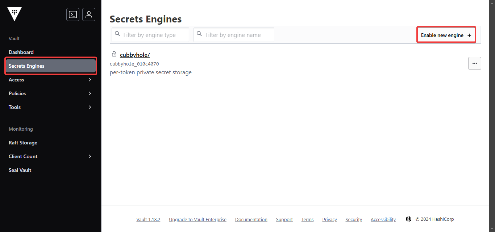
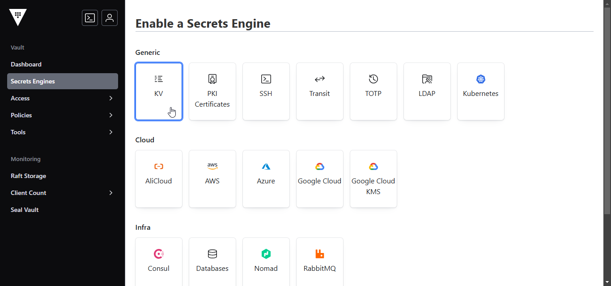
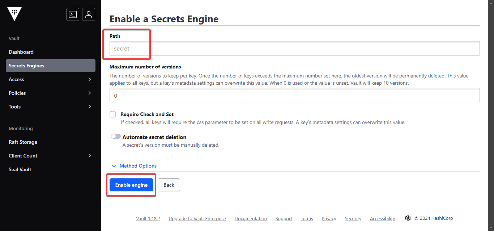

 [](https://openexchange.intersystems.com/package/intersystems-iris-dev-template)
 [](https://community.objectscriptquality.com/dashboard?id=musketeers-br%2Fvault-link)
 [](https://community.objectscriptquality.com/dashboard?id=musketeers-br%2Fvault-link)

[](LICENSE)

# vault-link


Vault-Link is a security solution designed to safeguard sensitive information on InterSystems IRIS environments. 

## Description

Vault-Link is a security solution designed to safeguard sensitive information on InterSystems IRIS environments. 

It is a wrapper to access secrets stored into key vaults.

## Features

* Wrapper to access secrets stored into key vaults
* It is a wrapper to access secrets stored into key vaults

## Installation on your IRIS instance

Execute the following command to install the package into your IRIS instance:

```bash
zpm "install vault-link"
```

If you want just to test the package, follow the [#Running the demo environment](#Running-the-demo-environment) section.

## Running the demo environment

> **Note: The steps provided below are only for a local demo environment. It's not intended to be used in a production environment**

Make sure you have [git](https://git-scm.com/book/en/v2/Getting-Started-Installing-Git) and [Docker desktop](https://www.docker.com/products/docker-desktop) installed.

Clone/git pull the repo into any local directory

```bash
$ git clone https://github.com/musketeers-br/vault-link.git
```

Open the terminal in this directory and call the command to build and run InterSystems IRIS in container:
*Note: Users running containers on a Linux CLI, should use "docker compose" instead of "docker-compose"*
*See [Install the Compose plugin](https://docs.docker.com/compose/install/linux/)*

```bash
$ docker-compose up -d
```

Wait for the containers be ready.

Now we need to start the Hashicorp Vault container. A single configuration for it is provided at folder `./hashicorp/vault`. 

Access the Hashicorp Vault container and run the following command:

```
$ docker exec -it vault-new-1 /bin/sh
/ # vault operator init
```

If all went well, you should see something like this:

```
$ docker exec -it vault-new-1 /bin/sh
/ # vault operator init
Unseal Key 1: <unseal-key-1>
Unseal Key 2: <unseal-key-2>
Unseal Key 3: <unseal-key-3>
Unseal Key 4: <unseal-key-4>
Unseal Key 5: <unseal-key-5>

Initial Root Token: <token>

Vault initialized with 5 key shares and a key threshold of 3. Please securely
distribute the key shares printed above. When the Vault is re-sealed,
restarted, or stopped, you must supply at least 3 of these keys to unseal it
before it can start servicing requests.

Vault does not store the generated root key. Without at least 3 keys to
reconstruct the root key, Vault will remain permanently sealed!

It is possible to generate new unseal keys, provided you have a quorum of
existing unseal keys shares. See "vault operator rekey" for more information.
/ #
```

This output indicates that the Vault has been initialized with 5 key shares and a key threshold of 3. You have to use 3 of these keys to unseal the Vault.

```
Unseal Key 1: <unseal-key-1>
Unseal Key 2: <unseal-key-2>
Unseal Key 3: <unseal-key-3>
Unseal Key 4: <unseal-key-4>
Unseal Key 5: <unseal-key-5>
```

A token is also generated, which you will use to access the Vault.

```
Initial Root Token: <token>
```

Now access the Vault UI at [http://localhost:18200](http://localhost:18200).

You will be prompted to unseal the Vault by providing the 3 unseal keys. Enter 3 of any of the 5 given in the output of the previous command.


After that, you will be asked to provide the initial root token. Enter the token generated in the output of the previous command.


Congrats! You have successfully installed and started the Hashicorp Vault container.


Now you can exit the container.

## Usage

First let's create a secret path in the Hashicorp Vault UI. 

In the left menu, click on "Secrets" and then click on "Enable new engine" to create a new secret path.



Then select Generic/KV.



Finally, set the path as "secret" and click on "Enable engine".



Access the InterSystems IRIS container:

```bash
$ docker exec -it vault-link-iris-1 /bin/bash
```

Post your secret to this Hashicorp Vault API endpoint to create a secret:

```bash
$ curl -X POST -H "X-Vault-Token: <token>" -H "Content-Type: application/json" -d '{"data": {"username": "my-user", "password": "my-password"}}' "http://host.docker.internal:18200/v1/secret/data/my-secret"
```

If all is well, you should see the following response:

```json
{"request_id":"ec66d118-b5a4-f10e-9300-c0abf2f1373e","lease_id":"","renewable":false,"lease_duration":0,"data":{"created_time":"2024-12-11T01:56:05.7512287Z","custom_metadata":null,"deletion_time":"","destroyed":false,"version":1},"wrap_info":null,"warnings":null,"auth":null,"mount_type":"kv"}
```

In order to read the secret, use the same endpoint, but this time with a GET request:

```bash
$ curl -X GET -H "X-Vault-Token: <token>" "http://host.docker.internal:18200/v1/secret/data/my-secret"
```

You should see the following response:

```json
{"request_id":"c21c3c88-0a63-b120-7354-0e4a6a6a2af6","lease_id":"","renewable":false,"lease_duration":0,"data":{"data":{"password":"my-password","username":"my-user"},"metadata":{"created_time":"2024-12-11T02:11:39.2138298Z","custom_metadata":null,"deletion_time":"","destroyed":false,"version":1}},"wrap_info":null,"warnings":null,"auth":null,"mount_type":"kv"}
```

Note that you have to provide the same token that you used to authenticate in the X-Vault-Token header.

You can see the secret in the portal:


